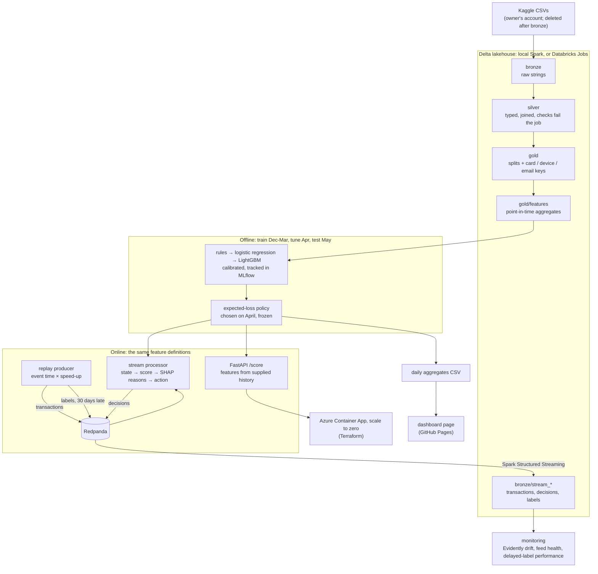

# Real-Time Card Fraud Detection

[](https://github.com/ssabeeth/fraud-detection/actions/workflows/ci.yml)

A production-style fraud system built on 590,540 real card-not-present transactions
(IEEE-CIS, from Vesta). It scores each transaction as it streams in, with the three
reasons behind every decision. It decides what to **decline or send to an analyst by
expected money lost**, not by a probability cut-off. It is trained and evaluated only on
the past, and every history feature uses only transactions strictly before the one
being scored. Three tests enforce that. Amounts are US dollars, the data's currency.

> **On the most recent month (May 2018), the chosen review policy catches 59.8% of fraud
> value at a cost of $278,535, against $474,219 for a rules baseline** that catches
> 16.1%. That is $195,684, or 41%, less. It is cheaper than the rules at both ends of
> every cost assumption's range (39% to 46% less). Approving everything would have cost
> $539,636.

Every number in this README comes from a report generated by code in
[`reports/`](reports/). Every decision is in [DECISIONS.md](DECISIONS.md). Failures are
kept, not tidied away (see [Failures kept](#failures-kept)).

## Results

### Correctness first

| Check | Scope | Result |
|---|---|---|
| Point-in-time: features recomputed from raw history by a naive implementation that shares no code with Spark | 4,495 sampled rows (899 fraud) × 17 aggregates on the real data; every row of the CI fixtures | **0 differences** ([pit_check.json](reports/pit_check.json)) |
| Canary: a window that includes the current row | CI fixtures | caught by the check above |
| Online vs offline features, in-process | all 590,540 transactions × 24 values | **0 mismatches** ([parity_check.json](reports/parity_check.json)) |
| Online vs offline, through Redpanda and back from Delta | the test month, 89,326 transactions × 20 values | **0 mismatches**; every action equal to the offline policy ([stream.md](reports/stream.md)) |

### Models (test month, May 2018)

Trained December 2017 to March 2018, tuned on April only, tested on May. No shuffling
across time. PR-AUC of a random score is the fraud rate, 3.49%.

| Model | PR-AUC | ROC-AUC | Recall at 1% false-positive rate | Fraud $ caught at 1% FPR | Calibration error |
|---|---|---|---|---|---|
| Rules baseline (points on amount and velocity) | 0.047 | 0.555 | 2.4% | 10.0% | — |
| Logistic regression (readable features) | 0.113 | 0.802 | 0.8% | 0.8% | 0.012 |
| **LightGBM** (452 features, depth ≤ 8, Platt-calibrated) | **0.547** | **0.902** | **47.2%** | **45.3%** | **0.005** |

Details, calibration curves and why logistic regression collapses in May are in
[reports/model.md](reports/model.md).

**Why LightGBM, checked across three months.** The brief named LightGBM, so the choice
was tested rather than assumed: LightGBM, XGBoost and CatBoost, each with four settings
and the same 452 features, were trained on every month before February, March and April
in turn and scored on that month once, without reading May. LightGBM had the highest
PR-AUC in all three months (mean 0.543, against 0.528
and 0.524); XGBoost tied it on money (mean $375,461 a month
against $374,667, cheaper in one month of three) and CatBoost cost more in every
month (mean $400,221). One decision with its SHAP reasons takes
4.2 ms with LightGBM, 5.9 ms with XGBoost and 43.8 ms with
CatBoost. [reports/model_comparison.md](reports/model_comparison.md).

### Money (test month)

| Policy (all tuned on April, same costs and capacity) | Total cost | Fraud value caught | Declines (legitimate) | Reviews (fraud) |
|---|---|---|---|---|
| Approve everything | $539,636 | 0.0% | 0 | 0 |
| Rules baseline | $474,219 | 16.1% | 0 | 1,550 (119) |
| LightGBM, probability cut-offs | $337,319 | 47.4% | 2,354 (875) | 1,550 (235) |
| **LightGBM, expected-loss policy (chosen, frozen)** | **$278,535** | **59.8%** | 2,608 (1,092) | 1,481 (221) |

The cost model ([configs/costs.yaml](configs/costs.yaml)) prices a missed fraud at its
amount plus a $20 chargeback fee, a review at $7 of analyst time (catching 90% of the
fraud it sees), and a false decline at 25% of the amount plus $10. The queue takes 50
reviews a day, allocated in arrival order. Each assumption has a written rationale and a
range. Re-tuning on April at each end of each range, the policy saves $181,444 to
$244,152 against the rules on May. Ranking the queue by expected saving
(P(fraud) × (amount + fee) × catch rate − review cost − delay cost) instead of by
probability saves $53,155 on April with the same number of reviews. Full tables are in
[reports/policy.md](reports/policy.md).

### Streaming, serving, explainability, monitoring

- **Latency.** One process makes 183 decisions a second, each 5.4 ms (median) of
  online features, LightGBM score, exact TreeSHAP reasons and policy. Paced at 1,800×
  real time, a transaction's decision is published 15.5 ms after it is sent (p99
  56 ms) ([reports/stream.md](reports/stream.md)).
- **The price of explainability.** The same set-up on the 36 features a reviewer can be
  told about costs $371,047 on May, **$92,513 more**. 63% of the full model's alerts have
  one of Vesta's masked columns as their top reason
  ([reports/explainability.md](reports/explainability.md)).
- **Monitoring under a 30-day label delay.** Input-drift warnings fired on 16 of 25 days
  in May, on the velocity features (the same shift that broke logistic regression).
  Scores stayed stable (PSI ≤ 0.011), so no retrain was triggered. The weekly cohorts,
  complete only in June, confirm the model held (PR-AUC 0.49 to 0.59 against 0.62 on
  April). In a stress scenario the identity feed goes silent on 22 May; the feed-health
  check raises an alert on 23 May ([reports/monitoring.md](reports/monitoring.md)).

## Architecture



## How it works

1. **Lakehouse** ([data profile](reports/data.md)). The CSVs are converted once to Delta
   bronze as strings and deleted. Silver casts with `try_cast` and fails the job on
   unparseable values, duplicate or orphan keys, and out-of-range or unknown values.
   Gold adds the split and the entity keys. There is no card ID, so the pseudo-card key
   is `card1 + addr1 + (day − D1)`. Its stability is measured: 96.6% of repeat keys look
   like one card, and D1 rounding splits under 1% of them.
2. **Features** ([catalogue](docs/features.md)). There are 17 aggregates (card velocity
   and spend, time since the last transaction, amount against the card's history, new
   device or email, device and email activity) and 19 readable fields. They are defined
   once and implemented twice, as Spark window functions with an exclusive upper bound
   and as per-key streaming state. A third, naive implementation checks both.
   Transactions in the same second are invisible to each other in both paths.
3. **Models.** The rules come first, then logistic regression, then LightGBM, all tuned
   on April. Class imbalance is handled by tuned weights, not oversampling. Calibration
   is chosen by a time split inside April. Every read of the test month is logged with
   its purpose ([test_touches.jsonl](reports/test_touches.jsonl), 8 reads).
4. **Policy.** Each transaction gets the action with the lowest expected cost, plus a
   review when the expected saving clears a threshold tuned on April. The choice was
   written to [policy_frozen.json](reports/policy_frozen.json) before May was read. The
   stream processor and the API load that file.
5. **Explainability.** Each decision carries the top three positive TreeSHAP
   contributions in plain names. Masked columns are named by the family Vesta published.
   The segment checks come with a plain statement that the data holds no protected
   characteristics, so they are not a fairness audit. See the
   [model card](docs/model_card.md) and [data card](docs/data_card.md).
6. **Streaming.** A producer replays May in event time, with each label 30 days later.
   The processor keeps per-key state, warmed from the lake. Spark Structured Streaming
   lands all three topics in Delta, and parity is checked from there.
7. **Serving and monitoring.** FastAPI `/score`, `/health` and `/metrics` (Prometheus)
   run in a 416 MB Python environment. Monitoring covers daily drift and feed health, and
   weekly performance once each week's labels have arrived. Thresholds and the retrain
   rule are in [configs/monitoring.yaml](configs/monitoring.yaml).
8. **Cloud and dashboard.** A Databricks Asset Bundle runs phases 2 to 5 as serverless
   Jobs on Databricks Free Edition, and reproduces the local headline to the dollar
   ([docs/databricks.md](docs/databricks.md)). Terraform builds a scale-to-zero
   Container App behind a budget alert ([docs/deploy_azure.md](docs/deploy_azure.md)),
   live at [ca-fraud-api…azurecontainerapps.io](https://ca-fraud-api.whitestone-d35cd2c9.uksouth.azurecontainerapps.io/health)
   with a demonstration model trained on synthetic data (the first request after a quiet
   spell takes up to a minute while it starts). The daily aggregate CSV and the policy
   report feed a [dashboard page](https://ssabeeth.github.io/fraud-detection/) on GitHub Pages, rebuilt by
   `make dashboard` and checked by a test.

### Scoring a transaction

```bash
curl -s localhost:8000/score -H 'content-type: application/json' -d '{
  "transaction": {"TransactionID": 1, "TransactionDT": 13000000, "TransactionAmt": 249.99,
                  "ProductCD": "W", "card1": 9500, "addr1": 204, "D1": 0,
                  "P_emaildomain": "anonymous.com", "card4": "visa", "card6": "credit"},
  "history":   [{"TransactionID": 0, "TransactionDT": 12999000, "TransactionAmt": 249.99,
                  "ProductCD": "W", "card1": 9500, "addr1": 204, "D1": 0,
                  "P_emaildomain": "gmail.com"}]}'
```

The response carries `p_fraud`, `action`, `review_recommended`, the expected cost of each
action, the top three `reasons` (feature, plain name, value, SHAP contribution), every
feature computed from the history (here: one card transaction in the last hour, 1,000
seconds since the last one, a new email domain) and the latency.

## Quickstart

Needs Python 3.12 with `uv`, Java 17 (`brew install openjdk@17`) and Docker. The data
needs a Kaggle account that has accepted the competition rules.

```bash
make install            # virtualenv and pre-commit hooks
uv run kaggle auth login  # browser sign-in; or put a token in ~/.kaggle
make data               # download, bronze (deletes the CSVs), silver, gold, data profile
make features           # point-in-time features, the point-in-time check, parity
make train evaluate     # three models; reports/model.md
make policy explain     # the money policy and explainability; reports, model and data cards
make stream monitor     # Redpanda, the stream processor, the Spark sink, monitoring
make serve              # the API on http://localhost:8000/docs
make test               # unit tests (CI runs the Kafka tests too, against Redpanda)
```

CI (GitHub Actions) runs lint, a guard against committing competition rows, the tests,
the Spark jobs and both parity checks on synthetic fixtures, the stream against a
Redpanda container, `terraform validate` and `tflint`, and an image build with a smoke
test.

## Decisions

The full log with the options considered is in [DECISIONS.md](DECISIONS.md). The main ones:

- **Time.** `TransactionDT = 0` is 2017-11-30. Four of the five busiest days fall
  20–24 December, and D1's day boundary matches the anchor's midnight.
- **Strictly before, same second invisible.** A range frame `rangeBetween(-W, -1)`
  offline; same-second events are held as pending online.
- **Money, not cut-offs.** Seven cost assumptions, each with a range. One tuned
  threshold. The review queue is allocated in arrival order, since a stream cannot see
  the rest of the day.
- **LightGBM, and the check that it was right.** Gradient-boosted trees suit a wide,
  mostly anonymised table with many gaps and categories, and give exact SHAP reasons
  cheaply. A three-month comparison with XGBoost and CatBoost (above) backs the choice.
- **Depth ≤ 8.** Exact SHAP for every decision in milliseconds (see Failures kept).
- **No raw rows leave the machine.** The competition rules forbid redistribution. A
  pre-commit hook and CI reject any file with transaction IDs outside the synthetic
  fixtures. The public image carries a model trained on synthetic data only.

## Failures kept

- **The first LightGBM was too slow to explain.** Unconstrained leaf-wise trees (up to
  depth 57) needed 162 ms per decision for SHAP. Capping depth at 8 brought that to
  5.4 ms and cost $7,981 over May. The first model's results stay in DECISIONS.md.
- **Logistic regression collapses in May.** One legitimate pseudo-card with 1,393
  transactions supplies 809 of its top 893 scores. The trees saturate; the linear model
  extrapolates.
- **A bug in the ranking comparison.** The first version measured a review's saving
  against the wrong alternative, and probability ranking appeared to win. It was fixed
  on April only, without another read of May.
- **Other bugs caught and fixed** (each in DECISIONS.md or PROGRESS.md):
  - an ignore rule that kept the CI fixtures out of git;
  - quadratic Spark windows on hot keys;
  - a stream checkpoint that would have skipped a second replay;
  - a drift monitor that saw a silent feed only after ten days.

## Known limitations

- The all-features model leans on Vesta's masked columns (63% of alerts' top reason),
  whose point-in-time correctness cannot be checked from outside Vesta.
- The pseudo-card key is approximate: 11% of rows have a coarse key, and busy keys can
  be merged cards or business accounts.
- The cost model is a set of stated assumptions, not measured costs. The sensitivity
  table shows the ranking of policies holds across them, not that the dollar figures
  are exact.
- The time anchor is inferred. Hour of day is relative to Vesta's day boundary, not to
  any customer's local time.
- The offline split tunes on April as if its labels were known on 1 May. The monitoring
  honours the 30-day delay; the backtest does not.
- The data is from 2017-18 and one provider, with a 3.5% fraud rate, far above most
  portfolios.
- Streaming uses one partition and in-memory state. Restarting the processor re-warms
  from the lake.

## What production would add

- **A feature store** with offline point-in-time joins and online state, so the stream
  can be partitioned by card while device and email features stay correct, and the API
  no longer needs the caller to send history.
- **Case management**: a review queue UI whose analyst outcomes become labels in days,
  not the 30+ days a chargeback takes.
- **A step-up action**: 3-D Secure authentication as a cheaper alternative to declining,
  which the cost model can price like the other actions.
- **Model risk review**: independent validation, a challenger model in shadow mode,
  approval gates on retraining, and documentation to a model-risk standard such as the
  PRA's SS1/23.
- **Operational hardening**: latency SLOs and alerting on the metrics, data contracts
  with upstream feeds (the feed-health check is the start of one), and customer appeal
  routes for declines.

## Not comparable with the Kaggle leaderboard

The competition scored ROC-AUC on a later, unlabelled period. The winning solutions
identified clients across the training and test files and aggregated features over
both, including transactions after the one being scored. This project trains on four
months, tunes on the fifth and tests on the sixth, and every history feature uses only
earlier transactions. It answers a stricter question, so its numbers should not be
ranked against the leaderboard.

## Data and licence

[IEEE-CIS Fraud Detection](https://www.kaggle.com/competitions/ieee-fraud-detection)
(Vesta, via Kaggle). The competition rules allow non-commercial use for education and
research and forbid redistribution. This repository therefore contains **no raw rows**,
only aggregates and synthetic CI fixtures. To reproduce the results you need your own
Kaggle account that has accepted the rules.

## Repository layout

```
configs/        base.yaml (anchor, splits, label delay), costs.yaml, monitoring.yaml
src/fraud/      lakehouse/ features/ model/ policy/ explain/ stream/ serve/ monitor/ cli.py
tests/          unit, point-in-time, parity, stream (Kafka), API, bundle and export tests
reports/        generated reports and figures (aggregates only)
docs/           feature catalogue, model and data cards, Databricks and Azure guides
databricks/     Asset Bundle resources (with databricks.yml)
infra/azure/    Terraform for the Container App and budget
docker/         the scoring image
scripts/        synthetic fixture generator, raw-data guard, image build
exports/        the daily aggregate CSV for the dashboard
site/           the dashboard page, published to GitHub Pages
```
