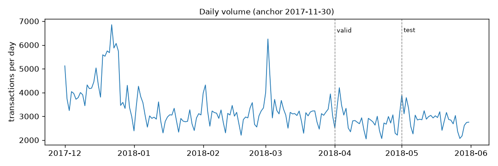

# Data profile

Generated by `fraud profile` from the gold table. Aggregates only. Amounts are USD.

## Splits

| Split | First day | Last day | Transactions | Fraud | Fraud rate | Amount | Fraud amount | With identity |
|---|---|---|---|---|---|---|---|---|
| train | 2017-12-01 | 2018-03-31 | 417,559 | 14,721 | 3.53% | $56,231,237 | $2,156,344 | 26.5% |
| valid | 2018-04-01 | 2018-04-30 | 83,655 | 2,828 | 3.38% | $11,257,171 | $450,145 | 17.7% |
| test | 2018-05-01 | 2018-05-31 | 89,326 | 3,114 | 3.49% | $12,250,541 | $477,356 | 21.0% |

## By month

| Month | Transactions | Fraud rate | Fraud amount |
|---|---|---|---|
| 2017-12 | 137,321 | 2.59% | $480,522 |
| 2018-01 | 92,585 | 4.00% | $511,260 |
| 2018-02 | 86,021 | 4.01% | $483,113 |
| 2018-03 | 101,632 | 3.95% | $681,449 |
| 2018-04 | 83,655 | 3.38% | $450,145 |
| 2018-05 | 89,326 | 3.49% | $477,356 |

## Time anchor check

With `TransactionDT = 0` at 2017-11-30T00:00:00 UTC, the busiest days are:

| Day | Transactions |
|---|---|
| 2017-12-22 | 6,852 |
| 2018-03-02 | 6,252 |
| 2017-12-24 | 6,065 |
| 2017-12-23 | 5,872 |
| 2017-12-20 | 5,749 |

Transactions by weekday under this anchor: Fri 98,502, Thu 86,377, Mon 85,433, Wed 85,356, Tue 84,815, Sat 79,834, Sun 70,223.

## Pseudo-card key stability

`card_key = card1 _ addr1 _ (transaction day − D1)`; see `fraud/features/keys.py`.

| Measure | Value |
|---|---|
| Rows | 590,540 |
| Distinct keys | 217,850 |
| Rows per key: median / p90 / p99 / max | 1 / 6 / 20 / 1,414 |
| Rows whose key has history (≥2 rows) | 78.8% |
| Rows with addr1 or D1 missing (weaker key) | 11.3% |
| Repeat keys with one card4/card6/card2/card5 (consistent with one card) | 96.6% |
| Repeat keys with one email domain | 71.4% |
| Repeat keys with both fraud and non-fraud rows | 3.4% |
| Key pairs sharing card1+addr1 with first-seen days 1 / 2 / 3 / 4 / 5 apart | 44,053 / 43,374 / 42,963 / 42,466 / 41,974 |
| Excess of 1-day pairs over the 2-5 day mean (cards likely split by D1 rounding) | 1,359 |
