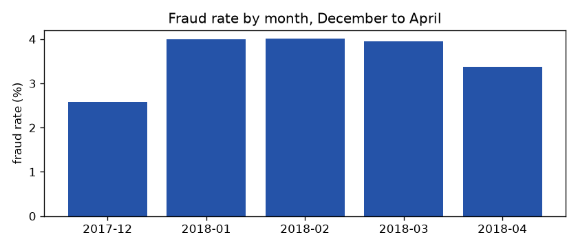
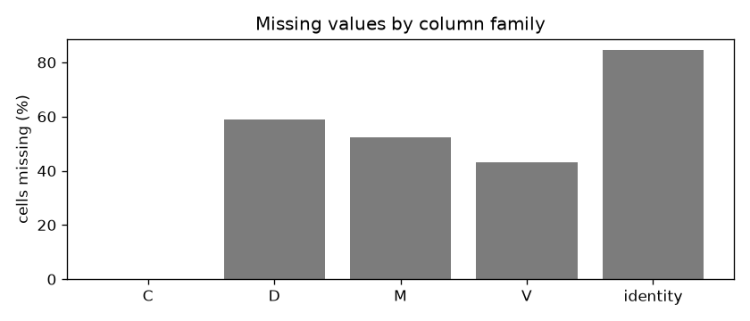
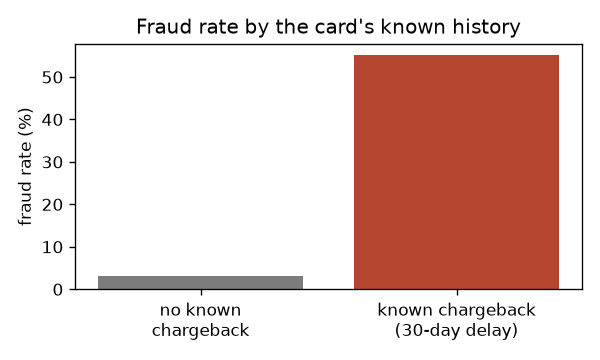
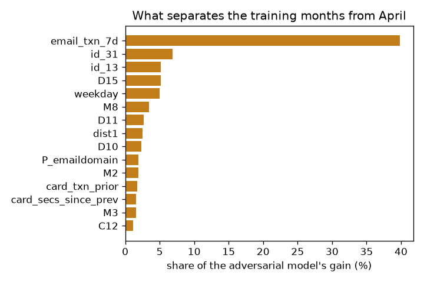

# Data patterns and what they changed

Generated by `fraud patterns` from 2017-12-01 to 2018-04-30 (501,214 transactions): the training months and April. **May, the test month, is not read.** Each pattern ends with what it changed: a decision already made (DECISIONS.md) or one of the pre-registered experiments ([experiments.md](experiments.md)).

## 1. Fraud is rare, and larger than average

17,549 frauds, **3.50%** of transactions but **3.86% of the money**. A model that flags nothing is 96.5% accurate and useless.

→ Judged by PR-AUC, recall at fixed false-positive rates and money, never accuracy or ROC-AUC alone. Imbalance is handled by weighting, not oversampling (which would distort the calibrated probabilities the money policy needs). *Experiment 9* tests a five-fold positive weight.

## 2. The fraud rate moves month to month

| Month | Transactions | Fraud rate | Fraud value |
|---|---|---|---|
| 2017-12 | 137,321 | 2.59% | $480,522 |
| 2018-01 | 92,585 | 4.00% | $511,260 |
| 2018-02 | 86,021 | 4.01% | $483,113 |
| 2018-03 | 101,632 | 3.95% | $681,449 |
| 2018-04 | 83,655 | 3.38% | $450,145 |

From 2.59% (2017-12) to 4.01% (2018-02): a relative swing of 55%. Volume moves too: four of the five busiest days fall 20 to 24 December ([data.md](data.md)).

→ Splits are by time only. Because one month can mislead, the model library and every experiment are judged on three scored months, not April alone ([model_comparison.md](model_comparison.md)). *Experiment 8* asks whether older months still help or whether a recent window is better.

## 3. Products differ sharply

| Product | Share of transactions | Fraud rate |
|---|---|---|
| C | 11.8% | 11.38% |
| S | 1.7% | 6.26% |
| H | 6.1% | 4.63% |
| R | 6.7% | 3.62% |
| W | 73.7% | 2.08% |

→ ProductCD is a feature, and the segment checks in phase 6 report alert rates and precision per product.

## 4. Having an identity record is itself a signal

25.0% of transactions have an identity record. Their fraud rate is 7.60%, against 2.13% without.

→ `has_identity` is a feature, and identity columns are left missing rather than filled: the absence is informative. The monitoring's feed-health check watches the share of rows carrying these fields, since a silent identity feed would shift scores.

## 5. Most masked columns are mostly missing, in blocks

| Family | Columns | Cells missing | Columns over half missing |
|---|---|---|---|
| C | 14 | 0.0% | 0 |
| D | 15 | 58.8% | 9 |
| M | 9 | 52.3% | 4 |
| V | 339 | 43.1% | 170 |
| identity | 38 | 84.4% | 38 |

The 339 V columns fall into 14 groups that are missing together: they come from a handful of sources and are heavily redundant.

→ No imputation: LightGBM routes missing values to their own branch, and the same matrix is built for one streamed event. *Experiment 2* asks whether the V columns earn their place at all.

## 6. Several categories have long tails

| Column | Distinct values | Present | Rows covered by the top 50 |
|---|---|---|---|
| card1 | 12,914 | 100.0% | 35.8% |
| addr1 | 330 | 88.8% | 98.6% |
| P_emaildomain | 59 | 84.4% | 99.9% |
| R_emaildomain | 60 | 23.7% | 99.9% |
| DeviceInfo | 1,678 | 20.6% | 84.5% |
| id_30 | 73 | 13.7% | 98.5% |
| id_31 | 111 | 24.4% | 98.4% |

→ Categorical columns keep their 50 most frequent training levels; the rest share one `__other__` level, so an unseen value in the stream cannot break the model. card1 and addr1 have too many values for that and are used as numbers and, above all, through the pseudo-card key.

## 7. Amounts: fraud is a little larger in the middle, not in the tail

| | Median | 90th percentile | 99th percentile | Amounts with cents |
|---|---|---|---|---|
| Legitimate | $68.50 | $269.95 | $1,104.00 | 48.3% |
| Fraud | $76.60 | $335.00 | $994.00 | 46.5% |

The fraud rate is 3.37% for amounts with cents and 3.62% for whole dollars: the amount alone separates the classes weakly.

→ The amount matters less on its own than against the card's own history, so the per-card z-score and ratio are features. And because a missed large fraud costs more than a missed small one, the policy ranks the review queue by expected money, not probability.

## 8. Fraud clusters by hour

The fraud rate is highest at hour 7 (10.80%) and lowest at hour 13 (2.17%), relative to the time anchor.

→ Hour of day and weekday are features.

## 9. Fraud labels cover whole clients

191,368 pseudo-card keys; 77.9% of keyed transactions belong to a key seen more than once. Among repeat keys with any fraud (4,351), **42.5% of their transactions are fraud**, and 39.1% of them are fraud throughout: once a client is marked, later transactions tend to be marked too.

| The card's earlier frauds are... | Rows with one | Fraud rate if so | Fraud rate if not | Frauds that had one |
|---|---|---|---|---|
| known after the 30-day label delay | 0.72% | 55.1% | 3.13% | 11.3% |
| known instantly (not realistic) | 4.75% | 44.5% | 1.46% | 60.4% |

With the realistic delay, a card with a known chargeback is 18 times as likely to be fraud, but few frauds have one: the delay hides most of this signal. The top Kaggle solutions exploited the same client-level labelling using each client's transactions across the whole dataset, future ones included, which a live system cannot do.

→ The pseudo-card key and its point-in-time aggregates exist because of this. *Experiment 5* adds the delayed-label history as features, and *experiment 4* per-card means of earlier C and D values, a softer way of recognising a client.

## 10. D columns are day counts that grow with time

| Column | Present | Repeat cards with a constant raw value | Constant after normalising (day − D) |
|---|---|---|---|
| D1 | 99.8% | 20.1% | 100.0% |
| D4 | 70.7% | 11.4% | 31.6% |
| D10 | 86.3% | 18.9% | 31.8% |
| D15 | 84.0% | 11.1% | 36.6% |

D1 is constant after normalising by construction: the pseudo-card key includes day − D1. For the others, normalising makes D4 constant for 32% of repeat cards (raw 11%), D10 constant for 32% of repeat cards (raw 19%), D15 constant for 37% of repeat cards (raw 11%): a partial client fingerprint, not a fixed one.

Mean raw value by month: D1 72, 96, 97, 94, 111; D4 126, 132, 135, 133, 160; D10 113, 119, 116, 114, 139; D15 146, 154, 157, 156, 189. Raw D values rise as the data goes on.

→ The pseudo-card key already uses day − D1. *Experiment 3* normalises the other D columns the same way.

## 11. Adversarial validation: what tells April from the training months

A model asked to tell April from December to March reaches **AUC 0.981** (0.5 would mean no difference). Its top features:

| Feature | Share of its gain |
|---|---|
| `email_txn_7d` | 39.8% |
| `id_31` | 6.9% |
| `id_13` | 5.2% |
| `D15` | 5.1% |
| `weekday` | 5.0% |
| `M8` | 3.4% |
| `D11` | 2.7% |
| `dist1` | 2.6% |
| `D10` | 2.3% |
| `P_emaildomain` | 1.9% |
| `M2` | 1.9% |
| `card_txn_prior` | 1.7% |
| `card_secs_since_prev` | 1.6% |
| `M3` | 1.6% |
| `C12` | 1.2% |

Why the leading ones drift:

- `email_txn_7d`: it counts every transaction from the same email domain in the past week, so for a large domain it tracks the site's overall traffic, which changes by month.
- `id_31`: browser and version; new versions appear as the months pass.
- `id_13`: a masked identity field whose values shift between months.
- `D15`: a raw day count (section 10).
- `D11`: a raw day count (section 10).
- `D10`: a raw day count (section 10).

→ Features that mainly encode *when* a transaction happened can help a model on the months it saw and hurt it later. *Experiment 7* drops the ten most time-dependent; *experiment 3* removes the time trend from the D columns instead.
