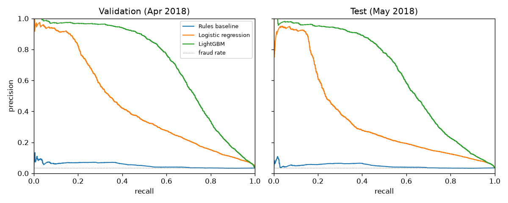
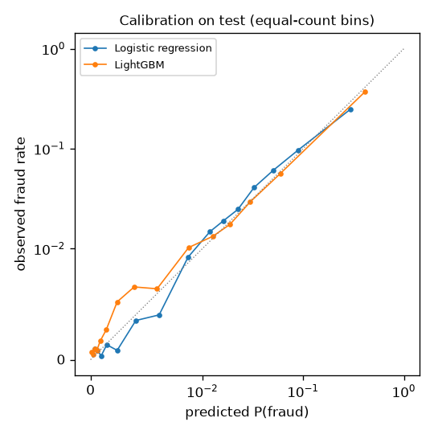
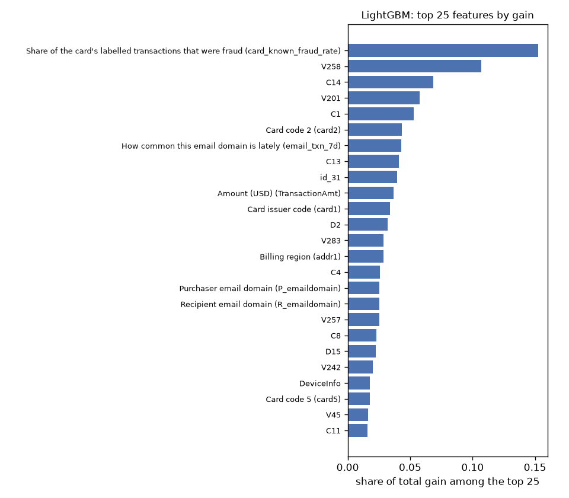

# Models

Generated by `fraud evaluate`. Every number comes from the frozen bundles in
`data/models/`; tuning used the validation month only. Amounts are USD.

**Split.** Train December 2017 to March 2018 (417,559 transactions), validation
April 2018 (83,655), test May 2018 (89,326). No shuffling across time. The test
month has been read 9 time(s) so far; each read and its purpose is
logged in `reports/test_touches.jsonl`.

## Test month (May 2018)

| Model | PR-AUC | ROC-AUC | Recall at FPR 0.1% / 0.5% / 1% / 5% | Fraud $ caught at FPR 1% | Brier | ECE |
|---|---|---|---|---|---|---|
| Rules baseline | 0.047 | 0.555 | 0.2% / 1.2% / 2.4% / 7.9% | 10.0% | — | — |
| Logistic regression | 0.354 | 0.884 | 15.9% / 20.6% / 25.0% / 46.2% | 24.6% | 0.0272 | 0.0053 |
| LightGBM | 0.638 | 0.932 | 32.8% / 49.5% / 56.1% / 72.3% | 53.3% | 0.0189 | 0.0040 |

LightGBM's test PR-AUC is 13.6x the rules baseline's and 1.80x logistic regression's. PR-AUC of a random score equals the fraud rate (3.49%). Recall at a false-positive rate counts fraud caught when that share of legitimate transactions is flagged. The rules produce points, not probabilities, so they have no Brier score or ECE.

### Why logistic regression falls on the test month

From April to May, logistic regression's PR-AUC falls by 19% (0.434 to 0.354) and LightGBM's by 10% (0.708 to 0.638). In May one pseudo-card key has 1,393 transactions (0.0% fraud), probably a business account or several cards sharing a key. 1.5% of May's transactions come from a card with more than 100 transactions in the previous 30 days, against 0.01% in April. Logistic regression extends its velocity terms linearly beyond anything it was trained on, so that one legitimate key fills its alert list; LightGBM's trees stop at the largest split they learnt:

| Model | Top 1% of test scores | From the busiest key | Fraud among them |
|---|---|---|---|
| Rules baseline | 893 | 10 | 8.3% |
| Logistic regression | 893 | 45 | 66.6% |
| LightGBM | 893 | 0 | 94.3% |

The monitoring phase is where a shift like this should be caught before it costs money (reports/monitoring.md).

### Cost of one decision

One transaction at a time (median / 99th percentile over 500 validation rows, on the development laptop): score 0.19 / 0.28 ms; score with exact TreeSHAP reasons 3.8 / 4.2 ms. TreeSHAP costs trees × leaves × depth², which is why the trees are limited to depth 8 (DECISIONS.md).

## Validation month (April 2018)

| Model | PR-AUC | ROC-AUC | Recall at FPR 0.1% / 0.5% / 1% / 5% | Fraud $ caught at FPR 1% | Brier | ECE |
|---|---|---|---|---|---|---|
| Rules baseline | 0.052 | 0.581 | 0.3% / 1.5% / 2.9% / 9.1% | 10.6% | — | — |
| Logistic regression | 0.434 | 0.911 | 18.4% / 26.7% / 32.0% / 57.5% | 35.0% | 0.0244 | 0.0043 |
| LightGBM | 0.708 | 0.950 | 40.8% / 57.6% / 64.3% / 79.1% | 72.5% | 0.0158 | 0.0011 |

## How each model was fitted

- **Rules baseline** — five hand-written rules with points: amount ≥ $500 (2), ≥ 2 card transactions in the last hour (2), ≥ 3 in 24 hours (1), 24-hour spend including this one ≥ $500 (1), and a new device for the card with amount ≥ $100 (1). Ties are broken by amount. The five thresholds were chosen from a grid of round values (432 combinations) by validation PR-AUC.
- **Logistic regression** — the explainable features without the masked card and address codes; signed log transform, standardised, one-hot categories. C = 10.0, class weight = None, chosen from 8 settings by validation PR-AUC. Calibration: none.
- **LightGBM** — all 455 features (history aggregates, readable fields and Vesta's anonymised columns). num_leaves = 63, min_child_samples = 200, scale_pos_weight = 1.0, 1193 trees (early stopping on validation PR-AUC), chosen from 8 settings. Calibration: platt.

**Imbalance** is handled by weighting, tuned as a hyperparameter (`class_weight`, `scale_pos_weight`), not by oversampling. See DECISIONS.md.

**Calibration.** The policy multiplies P(fraud) by the amount, so probabilities must be right, not just well ordered. The method was chosen by a two-fold time split inside the validation month (fit on one half, Brier score on the other):

| Model | none | Platt | isotonic | chosen |
|---|---|---|---|---|
| Logistic regression | 0.02444 | 0.02465 | 0.02461 | none |
| LightGBM | 0.01597 | 0.01588 | 0.01590 | platt |

## Not comparable with the Kaggle leaderboard

The competition was scored by ROC-AUC on a later, unlabelled period, and the winning
solutions identified clients across the training and test files and aggregated
features over both, including transactions after the one being scored. Here the
model is trained on four months, tuned on the fifth and tested on the sixth, and every
history feature uses only earlier transactions. The numbers answer a different,
stricter question and should not be ranked against the leaderboard.
