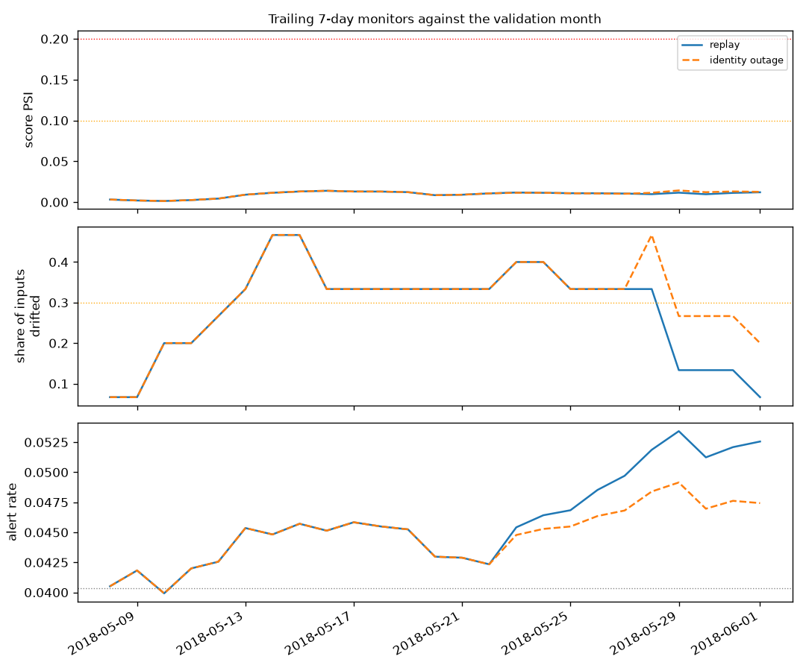

# Monitoring

Generated by `fraud monitor`. Inputs are what production would have seen: the decision
log and raw transactions the stream landed in Delta bronze, and labels as they came off
the labels topic, each 30 days after its transaction. The reference is the validation
month (April 2018) scored with the same model and frozen policy.

## Thresholds (`configs/monitoring.yaml`)

| Monitor | Warn | Alert |
|---|---|---|
| Score drift: PSI of P(fraud), trailing 7 days | 0.1 | 0.2 |
| Input drift: share of monitored inputs drifted (Evidently per-column tests) | 30% | — |
| Alert rate (declines + reviews) vs validation's 4.04% | ±50% relative | — |
| Feed health: a field present on under half its usual share of the latest day's transactions | — | feed alert (fix the feed; never retrain on it) |
| Performance of a complete weekly cohort: PR-AUC vs validation's 0.708 | — | below 80% of it |
| Performance of a complete weekly cohort: fraud value caught vs validation's 71.0% | — | 10 points lower |

**Retrain trigger:** a performance alert on a complete cohort, or a score-drift alert on 7 consecutive days together with an input-drift warning. A retrain uses every label that has arrived, so it can only ever learn from transactions at least 30 days old.

The reference month is also the month the model's early stopping, hyperparameters, calibration and review threshold were chosen on, so it flatters the model a little: a cohort has to fall short of a slightly optimistic mark before it alerts.

## Replay of the test month (as streamed)

- Score PSI peaked at 0.014 on 2018-05-16; 0 of 25 days at alert level, 0 at warn level.
- Input drift warnings on 16 of 25 days. Inputs most often drifted: `email_txn_7d` (25), `card_txn_prior` (18), `device_txn_24h` (17), `card_txn_24h` (16), `card_amt_24h` (15), `card4` (6).
- Feed alerts: none.
- Retrain trigger: **2018-06-14** (performance alert on 2018-05-08).

| Weekly cohort (transactions from) | Transactions | Labels complete on | PR-AUC | Fraud value caught | Alert |
|---|---|---|---|---|---|
| 2018-05-01 | 22,018 | 2018-06-07 | 0.667 | 63.3% | no |
| 2018-05-08 | 20,716 | 2018-06-14 | 0.584 | 60.3% | yes |
| 2018-05-15 | 20,454 | 2018-06-21 | 0.620 | 65.7% | no |
| 2018-05-22 | 18,027 | 2018-06-28 | 0.681 | 71.6% | no |
| 2018-05-29 | 8,111 | 2018-07-01 | 0.647 | 73.6% | no |

## Stress scenario: identity feed silent from 2018-05-22

Replayed in-process with the same delayed labels. Up to 2018-05-22 it decided all 63,188 transactions exactly as the stream did (largest P(fraud) difference 0.0e+00).

- Score PSI peaked at 0.014 on 2018-05-29; 0 of 25 days at alert level, 0 at warn level.
- Input drift warnings on 16 of 25 days. Inputs most often drifted: `email_txn_7d` (25), `card_txn_prior` (18), `device_txn_24h` (17), `card_txn_24h` (16), `card_amt_24h` (15), `card4` (6).
- Feed alert: first on **2018-05-23** (`device_txn_24h`, `DeviceType`, `has_identity`); 10 days with a feed alert.
- Retrain trigger: **2018-06-14** (performance alert on 2018-05-08).

| Weekly cohort (transactions from) | Transactions | Labels complete on | PR-AUC | Fraud value caught | Alert |
|---|---|---|---|---|---|
| 2018-05-01 | 22,018 | 2018-06-07 | 0.667 | 63.3% | no |
| 2018-05-08 | 20,716 | 2018-06-14 | 0.584 | 60.3% | yes |
| 2018-05-15 | 20,454 | 2018-06-21 | 0.620 | 65.7% | no |
| 2018-05-22 | 18,027 | 2018-06-28 | 0.679 | 70.4% | no |
| 2018-05-29 | 8,111 | 2018-07-01 | 0.648 | 73.3% | no |

## What the label delay means

Nothing about a week's fraud can be measured until 30 days after it ends, so the first
complete May cohort is known only in June. The drift monitors are the only signal
available while the month is under way, which is why the retrain rule needs a score
alert that persists and is backed by input drift, not a single noisy day.
